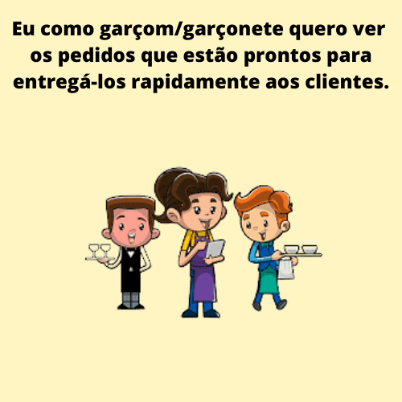

# Burger Queen (API Client)

## Índice

- [1. Projeto](#1-projeto)
- [2. Planejamento](#2-planejamentoo)
- [3. Protótipo](#3-protótipo)
- [4. Paleta de Cores](#4-paleta-de-cores)
- [5. Logotipo](#5-logotipo)
- [6. Desenvolvimento](#6-desenvolvimento)
- [7. UI e UX](#7-ui-e-ux)
- [8. Objetivos de aprendizagem](#8-objetivos-de-aprendizagem)
- [9. Tecnologias utilizadas](#9-tecnologias-utilizadas)
- [9. Desenvolvedoras](#9-desenvolvedoras)

---

## 1. Projeto

Vixi é um pequeno restaurante 24h que tem como cardápio principal hambúrgueres, como houve um aumento
significativo no movimento do empreendimento, será necessário ter um sistema próprio que auxilie 
os funcionários do salão e da cozinha, a controlar o fluxo de pedidos de forma ordenada e eficiente.

Nosso cliente solicitou que desenvolvesemos uma interface (cliente) que se integre com a API
(servidor) que outra equipe de desenvolvedoras está trabalhando simultaneamente, sua principal 
exigência é ter uma aplicação feita para utilização principalmente em tablets, com fácil usabilidade 
para que seus funcionários consigam acesar a plataforma com facilidade.

## 2. Planejamento

Para conseguir entregar todas as funcionalidades do projeto, organizamos todo o fluxo de desenvolvimento 
utilizando o método Kanban no Github Projects, utilizamos issues, milestone, labels para controlar as tarefas, 
organizar diferentes tipos de problemas, melhorias e bugs do projeto

Dessa forma, definimos:

- MVP (Mínimo Produto Viável)

- Critérios mínimos de aceitação

- Divisão de tarefas

- FDP (Fatiar, Descartar e Priorizar)

## 3. Protótipo

De acordo com as informações passadas pelo cliente, desenvolvemos o protótipo de baixa fidelidade, primeiramente
para mobile.

Fizemos ajustes no protótipo, pois identificamos, atraves de pesquisa com usuários, que algumas alterações seriam
benéficas e trariam mais agilidade a aplicação e tornaria a ferramenta mais fácil para os funcionários.
Abaixo o protótipo de alta fidelidade, tablete e desktop.

## 4. Paleta de Cores

A paleta de cores foi escolhida com tons que remetem ao sertão nordestino brasileiro.

## 5.Logotipo e Nome do Restaurante

As imagens no logo e o nome do restaurante, foram escolhidos para homenagiar nossos pais, nascidos nos estados de Pernambuco e Piaui e também o sertão nordestino brasileiro.

## 6.Desenvolvimento

 - A aplicação foi desenvolvida como SPA (single-page application), para que o usuário tenha a experiência similar à de um aplicativo para desktop.

- É responsiva para tablets utilizados na horizontal e Desktop.

- Utilizamos React JS para componentizar todo o site. Isso mantém a aplicação com alto desempenho e também permite que os componentes sejam reutilizados, gerando um código de fácil manutenção por qualquer desenvolvedor.

- Instalamos o ESLint na aplicação para manter o código padronizado e pronto para ser testado.

:writing_hand: **História de usuário #1**

  

    
    </img>
  

:writing_hand: **História de usuário #2**

  

    
    </img>
  

:writing_hand: **História de usuário #3**

  

    
    </img>
  

:writing_hand: **História de usuário #4**

  

    
    </img>
  

  
 
Com base nas histórias dos usuários, organizamos o passo a passo do que deveriamos desenvolver:

|              HU #1 :heavy_check_mark:              	|           HU #2 :heavy_check_mark:          	|           HU #3 :heavy_check_mark:           	|          HU #4 :heavy_check_mark:          	|
|:--------------------------------------------------:	|:-------------------------------------------:	|:--------------------------------------------:	|:------------------------------------------:	|
|                 Criar login e senha                	|       Anotar nome do cliente e a mesa       	|            Ver os pedidos em ordem           	| Ver a lista de pedidos prontos para servir 	|
| Registrar usuário conforme setor(cozinha ou salão) 	| Adicionar e/ou excluir produtos aos pedidos 	| Marcar pedido como 'PRONTO' para ser servido 	|    Marcar os pedidos que foram entregues   	|
|            Fazer login na tela correta             	|     Ver resumo e o valor total do pedido    	| Ver o tempo que levou para preparar o pedido 	|                                            	|
|                                                    	|        Enviar o pedido para a cozinha       	|                                              	|                                            	|

## Aplicação

Resultado da aplicação após finalizarmos as 4 histórias de usuários.

## Acessos

Abaixo deixamos login e senha de contas já cadastradas para que possam utilizar a aplicação.

- Cozinha - cozinha@email.com - Senha: 123456

- Salão - salao@email.com - Senha: 123456

## 7.UI e UX

## Principais objetivos de UI: 

- Leitura clara de todos os textos

- Consistência e padrões para não confundir os usuários

- Design minimalista

- Navegação intuitiva

- Responsivo em tablets

- Liberdade e controle do usuário

## Principal objetivos de UX: 

- Ouvir os usuários e compreender como está a sua experiência com a aplicação.

Fizemos uma pesquisa com os usuários para sabermos as opiniões sobre a usabilidade, layout e funcionalidades da aplicação e identificar as possíveis melhorias que poderíamos fazer.

## Feedback e Sugestões de Melhorias

- Gostaram da paleta de cores, nome do restaurante e acharam fácil utilizar a aplicação.
- Fazer responsividade para mobile.
- Dividir lanches simples de duplos.

## 8.Objetivos de aprendizagem

### HTML e CSS
- [x] **Uso de HTML semântico**
- [x] **Uso de seletores de CSS**
- [x] **Empregar o modelo de caixa (box model): borda, margem, preenchimento**
- [x] **Uso de flexbox en CSS**
- [x] **Uso de media queries**

### JavaScript
- [x] **Testes unitários**
- [ ] **Testes assíncronos**
- [ ] **Mocking**
- [x] **Uso ES modules**
- [x] **Uso de linter (ESLINT)**
- [x] **Uso de identificadores descritivos (Nomenclatura | Semântica)**

### Git e GitHub
- [x] **Git: Controle de versão com git (init, clone, add, commit, status, push, pull, remote)**
- [x] **Git: Integração de mudanças entre ramos (branch, checkout, fetch, merge, reset, rebase, tag)**
- [x] **GitHub: Criação de contas e repositórios, configuração de chave SSH**
- [x] **GitHub: Implantação com GitHub Pages**
- [x] **GitHub: Colaboração pelo Github (branches | forks | pull requests | code review | tags)**
- [x] **GitHub: Organização pelo Github (projects | issues | labels | milestones | releases)**

### HTTP
- [x] **Solicitações o requisições (request) e respostas (response).**
- [x] **Cabeçalhos (headers)**
- [x] **Corpo (body)**
- [x] **Verbos HTTP**
- [x] **Codigos de status de HTTP**
- [x] **Encodings e JSON**
- [x] **CORS (Cross-Origin Resource Sharing)**

### react
- [x] **jsx**
- [x] **components**
- [x] **events**
- [x] **lists-and-keys**
- [x] **conditional-rendering**
- [x] **lifting-up-state**
- [x] **hooks**
- [x] **css-modules**
- [x] **routing**

### UX (User eXperience)
- [x] **Desenhar a aplicação pensando e entendendo o usuário**
- [x] **Criar protótipos para obter feedback e iterar**
- [x] **Aplicar os princípios de desenho visual (contraste, alinhamento, hierarquia)**
- [x] **Planejar e executar testes de usabilidade**

## 9.Tecnologias utilizadas

 
  
    
  
  

### Deploy

 
  

## 10.Desenvolvedoras

Abaixo link de nosso repositório e linkedin.

|                              Letícia Aniceto                             	      |                                 Paloma Queiroz                                	|
|:------------------------------------------------------------------------------: |:------------------------------------------------------------------------------:	|
|</img> | </img> 	|
| <a href='https://github.com/leticia-aniceto'></img></a> <a href='https://www.linkedin.com/in/leticia-braga-aniceto/'></img></a>  |  <a href='https://github.com/palomacqueiroz'></img></a> <a href='https://www.linkedin.com/in/palomac-queiroz/'></img></a> 	|          	|

